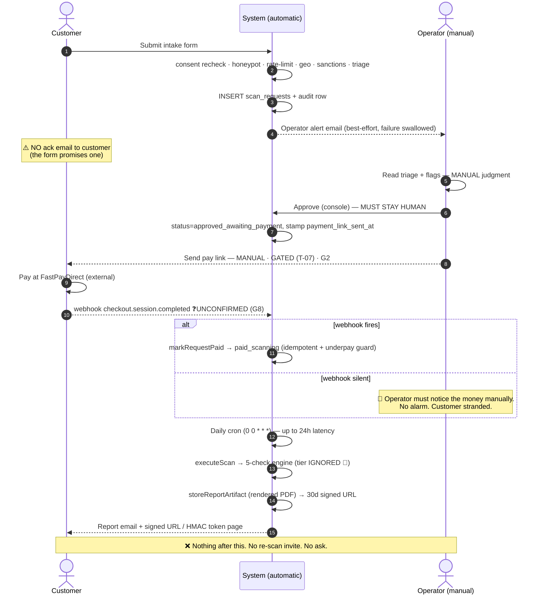

# AI Sec Tester — Business / Ops Journey Map (inside-out)

> **Verified against code, 2026-07-13.** The operator-side mirror of `docs/USER-JOURNEY-MAP.md`.
> **Operator = Creator = the only admin.** Solo. No team, no rota, no on-call.
> **Automation IDs** cross-reference `marketing/automation/00-AUTOMATION-ROADMAP.md` (G1–G11) and `marketing/automation/02-fulfillment-ops-automation.md` (A1–A8, M1–M6, S1–S6).
> Status vocabulary: **BUILT** (in code, working) · **BUILDABLE-NOW** (owned stack, no gate) · **GATED** (needs a Creator decision: money / outbound / destructive) · **NOT BUILT**.

---

## The operator's real job

The console does not run the business. **The operator is the transport layer between five automated stages.** Everything automatic is bracketed by a human step, and the human is a single point of failure with no alerting backstop.

The product's differentiator — *authorization-first, a human approves before anything runs* — is also its ops bottleneck. **That is a correct trade and must not be automated away** (`02-…#4 MUST STAY HUMAN`). The goal is to make every step *around* the human decision automatic, not to remove the human decision.

---

## Step-by-step

### OPS-1 — A request lands

| | |
|---|---|
| **Trigger** | Visitor submits the public form → `POST /api/scan-request`. |
| **Operator action** | None required at submit time. |
| **Where** | — |
| **Fires automatically** | Consent re-check (both boxes, server-side, 400 if missing) · honeypot · IP + email-domain rate-limit · Turnstile *(no-op — `TURNSTILE_SECRET_KEY` unset)* · requester IP→country · target DNS→country · `runTriage` · `reviewJurisdiction` · insert into `scan_requests` · append-only audit row · **operator alert email** (`sendNewRequestAlert` → `resolveOperatorEmail()` = first `ADMIN_EMAILS` entry, else `thesoulsofai@gmail.com`). Sanctioned requester **or** sanctioned target → `rejected`. Licence-regulated target (SG/MY) → **held** `pending_review` + flag. |
| **Manual today** | Nothing. |
| **Time cost** | 0 min. |
| **Automation status** | **BUILT** (A1–A4). |
| **Failure mode if operator is asleep** | Benign — the request is persisted. **But:** the alert email is **best-effort and swallowed on failure** (`console.error`, no retry). A dropped alert = a request that waits **forever** with nobody aware. There is no aging digest. |
| **Gap** | `[GAP: no requester acknowledgement email — the landing form promises one. See USER-JOURNEY-MAP Stage 6.]` `[GAP: S4 / no open-requests aging digest — BUILDABLE-NOW, ~1h, no gate, the single cheapest reliability fix in this document.]` |

---

### OPS-2 — Triage

| | |
|---|---|
| **Trigger** | The alert email (or the operator remembering to look). |
| **Operator action** | Read the request, the triage score/verdict, and the jurisdiction flags. Judge whether the requester plausibly owns or is authorized to test the target. |
| **Where** | `/command-center/intake` (linked from the alert email). Also `/command-center/cases`, `/command-center/gate`, `/command-center/disclosure`. |
| **Fires automatically** | Nothing new — the scoring already happened at intake. The console **displays** it. |
| **MANUAL today** | The entire judgment. |
| **Time cost** | ~5–15 min per request (reading context, checking the target, sanity-checking the geo story). |
| **Automation status** | **MUST STAY MANUAL** (M1/M2). Auto-approval (S1 / G10) is explicitly **not recommended for v1** — authorization is the receipt the product sells; moving it into code destroys the differentiator and creates real liability. |
| **Failure mode if operator is asleep** | The request sits. The customer sees nothing (no ack email exists). Conversion decays with every hour. |

---

### OPS-3 — Approve (or reject)

| | |
|---|---|
| **Trigger** | Operator's decision. |
| **Operator action** | Approve → case moves `intake → approval → approved`. Reject → terminal, with a reason. |
| **Where** | `/command-center/approval`. |
| **Fires automatically** | State machine enforcement (`lib/command-center/state.ts` — six statuses, `canTransition` checked before every DB write, fails closed on any out-of-order or garbage input). `approveScanRequestPayment()` stamps `stripe_client_reference_id` = request id, `status=approved_awaiting_payment`, `payment_link_sent_at=now`, and returns the param-appended checkout URL. |
| **MANUAL today** | The decision **and** getting the payment link to the customer (see OPS-4). |
| **Time cost** | ~2 min. |
| **Automation status** | Decision: **MUST STAY MANUAL**. The old one-click email-approval route `app/api/enterprise/approve` now returns **410 Gone** — approval was deliberately pulled back inside the admin-gated console. |
| **Failure mode** | None automatic — a wrong approve is a legal exposure, which is exactly why it is human. |

---

### OPS-4 — Send the payment link — **THE MONEY GATE**

| | |
|---|---|
| **Trigger** | An approved case. |
| **Operator action** | Get the FastPayDirect link (`lib/payment-links.ts` — $47 / $197 / $497) to the customer. |
| **Where** | `/command-center/emails`, `/command-center/products`. |
| **Fires automatically** | The URL is *composed* automatically (`resolvePaymentLink` + `buildPaymentUrl`). |
| **MANUAL / GATED today** | **The send.** Outbound money-adjacent send is blocked by **T-07** (Creator gate). Even with T-07 lifted, delivery requires **both** `RESEND_API_KEY` **and** `CC_EMAIL_SEND_ENABLED === "true"` (`lib/email-templates.ts`) — otherwise `deliverComposedEmail` logs and no-ops. |
| **Time cost** | ~5 min manual compose/send per request. |
| **Automation status** | **GATED — G2 / S2** ("Approve & send pay link" one-tap console action). Pieces all exist; wire behind one guarded button. Human still taps — *the tap is not the friction, the copy-paste is.* Highest revenue leverage of the gated set, and it is what arms G3. |
| **Failure mode** | If `payment_link_sent_at` is never populated, the **48h reminder and 14d auto-close never fire** — they are both derived from that timestamp (`paymentCountdown`). |

---

### OPS-5 — Customer pays → `paid_scanning` — **THE BIGGEST OPS RISK**

| | |
|---|---|
| **Trigger** | Money settles at FastPayDirect. |
| **Operator action** | **Unknown — and that is the problem.** |
| **Where** | `app/api/stripe/webhooks/route.ts` (if it fires) or `/command-center/scan` manual override (if it does not). |
| **Fires automatically** | *Designed:* `checkout.session.completed` → read `client_reference_id` → `markRequestPaid()` → `approved_awaiting_payment → paid_scanning`. **Idempotent** (conditional `WHERE status=approved_awaiting_payment`; a duplicate delivery updates zero rows). **Underpayment-guarded** (a $47 settlement carrying a $497 request's ref is rejected before the flip). |
| **MANUAL today** | **Effectively all of it.** |
| **Time cost** | Unbounded — the operator must *notice the money* in a separate system. |
| **Automation status** | **GATED / UNPROVEN — G8 / S3.** |
| **Failure mode if operator is asleep** | **A paying customer is silently stranded.** They paid; nothing runs; they receive nothing; they have no status page and no account. This is where a refund or a chargeback comes from. |

> ## 🔴 THE SINGLE BIGGEST OPS RISK: the FastPayDirect webhook is unconfirmed
> Every automated stage downstream of payment (dispatch → scan → report email) is keyed on `scan_requests.status = 'paid_scanning'`. **Only the webhook sets that status.**
> It is **UNCONFIRMED that FastPayDirect forwards `client_reference_id` and emits a signed Stripe `checkout.session.completed` event.** This is flagged in the webhook route's own comments, in `scan-request-lifecycle.ts` (`buildPaymentUrl`), and in roadmap **G8**.
> **If it does not fire, the money path is broken open and there is no alarm.** The system will not tell the operator that a customer paid. Nothing polls FastPayDirect. Nothing reconciles.
> **Actions, in order:**
> 1. **[NEEDS: verify]** Log into FastPayDirect and confirm whether it emits **signed** webhooks and forwards `client_reference_id`. This is a 10-minute check that gates the entire revenue loop.
> 2. If it **cannot** sign → **do not build it.** Never auto-launch a scan on an unauthenticated "paid" callback. Fall back to a manual "mark paid" tap in the console.
> 3. Either way, until this is proven: **treat "customer paid" as an unmonitored event and check for payments manually on a schedule.**

---

### OPS-6 — Dispatch → scan → finalize

| | |
|---|---|
| **Trigger** | Vercel Cron hits `GET /api/cron/dispatch-scans` with `Authorization: Bearer $CRON_SECRET`. |
| **Operator action** | **None** — this is the one genuinely hands-off stretch. |
| **Where** | Cron → `runScanForRequest` → `executeScan`. Manual override at `/command-center/scan`. |
| **Fires automatically** | Batch of 5 `paid_scanning` requests → bridge to `cc_case` → mint pending scan row → `activateCase` (approved → scanning, paid=true) → **`executeScan`** → `completeCase` → `storeReportArtifact` (Supabase Storage, 30-day signed URL, fail-soft) → `queueEmail` to `cc_email_log` → `deliverComposedEmail` → `scan_requests.status = complete`. Guards: `in_flight` (no double-run), bounded retry (**3 attempts**, clearing stale `scan_results` first), reconcile-if-already-complete. |
| **MANUAL today** | Nothing — **when it runs.** |
| **Time cost** | 0 min. |
| **Automation status** | **BUILT** (A5–A7), **GATED on G1** — needs `CRON_SECRET` set, migrations live, and a real `paid_scanning` transition upstream (OPS-5). `[NEEDS: proof one real end-to-end intake→approve→pay→scan→report has completed in prod. It has not.]` |
| **Failure modes** | (a) **The cron is DAILY** — `vercel.json` = `"0 0 * * *"`. The route's own doc-comment saying "every 5 min" is **stale and wrong**. Worst-case dispatch latency is **~24h**. **Do not market same-hour turnaround.** (b) Scans run **synchronously inside the request** (`maxDuration = 60`); a slow target or slow judge blows the 60s ceiling → the item fails into the retry path. (c) After 3 failed attempts the case falls to **manual review with no alert** — it just stops. |

> ### 🔴 CRITICAL — the paid tier never reaches the engine
> `executeScan` → `runEngineAndPersist` → **`runScanEngine`** (`lib/scan-engine.ts`, **5 checks, fixed**). `runEngineAndPersist` accepts **no tier parameter**. The tiered engine (`runTieredScanEngine`: basic 5 / pro 10 / enterprise 15) is only reachable from `app/api/local-scan/route.ts` — **never from the paid path.**
> **An Advanced ($197) or Enterprise ($497) customer receives the same 5-check scan as a $47 customer.** The landing's "Full OWASP LLM Top-10 coverage" (landing.tsx L92) is not delivered by the live code.
> **This is a fulfilment-integrity defect on the money path. Wire tier → engine before selling Advanced/Enterprise, or stop selling them.**

---

### OPS-7 — Chase / close

| | |
|---|---|
| **Trigger** | Daily cron, on `approved_awaiting_payment` rows. |
| **Operator action** | None (when enabled). |
| **Where** | `handleStale()` in the cron route. |
| **Fires automatically** | **48h** → ONE payment reminder (idempotent: guarded by a `Reminder:%` subject match in `cc_email_log`). **14d** → auto-reject with reason (idempotent via conditional `WHERE`). |
| **MANUAL today** | All of it — the reminder **re-sends a live payment link**, which is the same gate class as the first send. |
| **Time cost** | ~5 min per chase, if done by hand at all. |
| **Automation status** | **BUILT but GATED — G3 / A8.** `[NEEDS: confirm T-07's scope covers the *reminder* path, not just first send.]` |
| **Failure mode** | Unpaid approvals rot silently. Recovering one is a near-pure-margin $47–$497 from someone who already asked, passed due diligence, and got a price. |

---

### OPS-8 — Post-delivery

| | |
|---|---|
| **Trigger** | Report delivered. |
| **Operator action** | None exists. |
| **Fires automatically** | Nothing. |
| **NOT BUILT** | 30-day re-scan invite (**G7 / S5**) · testimonial/feedback ask (**G6**) · any nurture at all. |
| **Failure mode** | The Enterprise free re-scan — a paid-for benefit — **silently lapses** on the same 30-day clock as the signed report URL, and nothing marks it. |

---

## Swimlane — full lifecycle

## Swimlane — table

| Stage | Customer | System (automatic) | Operator (manual) |
|---|---|---|---|
| Discovery | Lands on scan.thesoulsofai.com | Landing renders; tiers from `payment-links.ts` | — |
| Intake | Submits form + 2 consents | Consent recheck, honeypot, rate-limit, geo, sanctions, triage, insert, audit, **operator alert** | — |
| Ack | *Sees "check your email"* | **[GAP: no customer email is sent]** | — |
| Triage | **Waits, blind** | Displays score + flags | **Reads and judges** (~5–15 min) |
| Approve | **Waits, blind** | State machine enforces transition | **Approves / rejects** (~2 min) |
| Pay link | Receives link | Composes URL (`buildPaymentUrl`) | **Sends it — GATED (T-07)** (~5 min) |
| Payment | Pays at FastPayDirect | Webhook → `markRequestPaid` **❓unconfirmed** | **May have to flip status by hand** |
| Dispatch | **Waits, blind, up to ~24h** | Daily cron → activate → `executeScan` (**5 checks, any tier**) | — |
| Report | Receives email + 30d signed URL | Store artifact (**rendered PDF**), queue + deliver email | — |
| Chase | Reminder at 48h / closed at 14d | `handleStale` — **coded, GATED** | Chases by hand today |
| Re-scan | Benefit lapses silently | **NOT BUILT** | — |
| Advocate | Never asked | **NOT BUILT** | — |

---

## Ops risk register (ranked)

| # | Risk | Severity | Evidence | Action |
|---|---|---|---|---|
| 1 | **FastPayDirect → Stripe webhook unconfirmed** — money may never trigger a scan, with no alarm | 🔴 CRITICAL | `app/api/stripe/webhooks/route.ts` comments; roadmap G8 | **Verify FPD signing + `client_reference_id` forwarding (10 min).** If unsignable, do not build it — use a manual "mark paid" tap. |
| 2 | **Paid tier never reaches the engine** — $497 buys the $47 scan | 🔴 CRITICAL | `scan-persistence.ts` calls `runScanEngine`, not `runTieredScanEngine`; no tier param | Wire tier → engine, or stop selling Advanced/Enterprise. |
| 3 | **No customer ack email** — the form promises one on every submission | 🔴 HIGH | `scan-request/route.ts` sends only `sendNewRequestAlert` (to operator) | Send a requester ack. Cheapest fix in the file. |
| 4 | **Operator alert failure is swallowed** — a dropped email = a request that rots forever | 🟠 HIGH | `catch { console.error }` in the intake route | Build **S4** daily aging digest. BUILDABLE-NOW, ~1h, no gate. |
| 5 | **Daily cron, not 5-min** — up to 24h latency while the site says "in seconds" | 🟠 HIGH | `vercel.json` `"0 0 * * *"` vs. the route's stale comment | Fix the comment; fix the copy; or raise the cron frequency. |
| 6 | **The pipe has never run end-to-end in prod** | 🟠 HIGH | roadmap **G1** — highest-value single action in that file | Apply migrations, set `CRON_SECRET`, run ONE real scan on an owned bot. |
| 7 | **RLS lockdown (0007) is authored but NOT applied** | 🟠 HIGH | `0007_scope_scans_rls.sql` header: *"⚠️ DO NOT APPLY YET"*; live DB still carries an out-of-band anon `using(true)` policy | Follow the migration's mandatory apply order. Deploy the service-role cutover, verify, **then** apply. |
| 8 | ~~Stored artifact is plain text, "branded PDF" is promised~~ | ✅ CLOSED 2026-08-01 | `storeReportArtifact` uploads `buildScanReportPdf` output as `application/pdf` | Done — A6 closed. |
| 9 | Scans run synchronously, `maxDuration = 60` | 🟡 MEDIUM | cron route | Fine at zero volume. Revisit if a scan regularly exceeds ~50s. |
| 10 | 3 failed attempts → manual review **with no alert** | 🟡 MEDIUM | `MAX_SCAN_ATTEMPTS` in `run-scan.ts` | Fold into the S4 digest. |
| 11 | **Single-operator, no rota, no SLA** | 🟡 STRUCTURAL | — | Accepted for a solo business. The S4 digest is the mitigation. |

---

## Recommended build order (MTCOOM — laziest first)

1. **Requester ack email** — no gate, minutes, closes a promise the site breaks on every submission.
2. **S4 daily aging digest** — no gate, ~1h, stops requests rotting when an alert drops.
3. **Tier → engine wiring** — no gate, and it is the difference between fulfilling and mis-selling.
4. **Verify the FastPayDirect webhook (G8)** — a 10-minute login that determines whether the revenue loop is automatic or manual.
5. **A6 PDF-in-storage swap** — ~1–2h, reuses the existing renderer.
6. **G1: prove the pipe once** — migrations + `CRON_SECRET` + one real end-to-end scan on an owned bot. **Unblocks every external claim.**
7. **G2 approve-&-send** *(Creator lifts T-07)* — highest revenue leverage; also arms G3.
8. **G3 reminder/auto-close**, then **G7 re-scan invite**.
9. **Defer G10 (auto-approve) and G11 (dunning ladder).** There is no funnel to measure yet.

## Hard gates — Creator only, never automated

- Money / pricing / payment / new subscriptions (**T-07** covers the outbound pay-link send, first send **and** reminder re-send).
- Public posting / outbound sending (G4, G5, G6).
- **The authorization decision itself** (M1/M2/G10). The system may score, flag, auto-reject clear sanctions hits, and hold licence-regulated targets. It may **never authorize**. That signature is the product.
- Destructive live ops.
