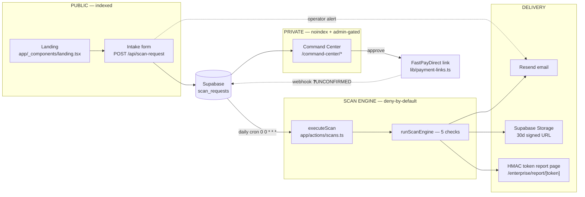

# AI Sec Tester — PRD

> **Supersedes** the original 6-line kickoff brief (which described a self-serve, login-based scanner with a live progress bar — **that is not what was built and not what this is**).
> **Verified against the code, 2026-07-13.** Every claim is labelled **BUILT** / **PARTIAL** / **GATED** / **NOT BUILT**. Anything unverifiable from the code carries `[NEEDS: …]`.
> Companion docs: `docs/USER-JOURNEY-MAP.md` (customer, outside-in) · `docs/BUSINESS-OPS-JOURNEY-MAP.md` (operator, inside-out) · `marketing/automation/00-AUTOMATION-ROADMAP.md` (G1–G11).

---

## 1. Problem

Teams ship AI chatbots — support widgets, sales bots, internal agents — and have no idea whether they can be jailbroken, made to leak their system prompt, or coaxed into disclosing data. The OWASP Top-10 for **LLM Applications** names the failure modes; almost nobody tests against them. The tooling that exists is either a security-firm engagement (slow, five figures) or a github script (free, unusable by a non-specialist, and **illegal to point at a system you don't own**).

The gap: **a fast, cheap, authorization-first OWASP-LLM scan with a report a non-security person can act on.**

## 2. Target user

Someone who has deployed an LLM chatbot and has just been asked to prove it is safe — by a client, procurement, a compliance form, or their own alarm after reading about a jailbreak. Typically non-security: a founder, a web developer, an agency builder.

No personas, demographics, or segment sizes are asserted. **There are zero customers to date.** No metrics, testimonials, or case studies exist, and none may be invented.

## 3. What it is / what it is NOT

**IS:** An **OWASP LLM Top-10** prompt-injection / jailbreak / data-leak scanner for chatbots. **Admin-operated.** The public site is a **request-a-scan intake form**. A human reviews and approves every request before any payment link is issued or any scan runs. Live at `scan.thesoulsofai.com`.

**IS NOT:**
- Not OWASP **Web** Top-10. It scans the LLM layer, not the web app.
- **No customer login.** No account, no dashboard, no self-serve checkout, no customer-triggered scan. (See `project-ai-sec-tester-architecture`.)
- Not a progress bar the user watches. The original brief's "watch a live progress bar" workflow was deliberately abandoned when the model moved to authorization-first.
- Not continuous monitoring, not backend/API pentesting, not automated vulnerability fixing, not custom payload uploads.
- Not an attack kit. The engine ships **no working exploit payloads** — only category-level descriptions (`lib/scan-engine.ts`).

## 4. Scope — tiers and exact per-tier deliverable

Source of truth: `app/_components/landing.tsx` (tier features) + `lib/payment-links.ts` (prices, FastPayDirect links). The two are wired — the landing imports the prices — so they cannot drift.

| Tier | Price | Advertised deliverable (landing.tsx) |
|---|---|---|
| **Normal** | **$47** one-time / scan | **5 OWASP LLM checks** · Pass/Fail scorecard · priority processing · branded PDF audit report · evidence per finding + remediation (L74) |
| **Advanced** | **$197** one-time | Everything in Normal · **Full OWASP LLM Top-10 coverage** · deeper probes per category · PDF reports emailed automatically (L92) |
| **Enterprise** | **$497** one-time / chatbot | Everything in Advanced · authorization + identity verification · automated risk triage · human review before scan · **Full report + 1 free re-scan after fixes** · secure token-gated report page (L111) |

> ### 🔴 CRITICAL — the advertised tier is NOT what the code delivers
> **NOT BUILT.** The paid path is `executeScan` (`app/actions/scans.ts`) → `runEngineAndPersist` (`lib/scan-persistence.ts`) → **`runScanEngine`** (`lib/scan-engine.ts`) — a **fixed 5-check** engine. **`runEngineAndPersist` takes no tier argument.** The tiered engine `runTieredScanEngine` (basic 5 / pro 10 / enterprise 15 checks, `lib/tiered-scan-engine.ts`) is called **only** from `app/api/local-scan/route.ts`, which the paid pipeline never touches.
> **An Advanced or Enterprise customer today receives the identical 5-check scan as a $47 Normal customer.** "Full OWASP LLM Top-10 coverage" is not delivered.
> **Requirement: wire tier → engine before any Advanced/Enterprise sale, or withdraw those tiers.** This is a mis-selling and chargeback exposure on the money path.

Checks surfaced on the landing (`CHECKS`): LLM01 prompt injection · LLM06 sensitive info disclosure · LLM07 system-prompt leakage · LLM08 excessive agency · JAILBREAK guardrail bypass · OUTPUT insecure output handling.

## 5. Architecture

### 5.1 Public intake — **BUILT**
`app/api/scan-request/route.ts`. Server-authoritative, client is advisory only:
- **Both** consent checkboxes (authorized-to-test + due-diligence) re-checked server-side → 400 if absent, regardless of what the client rendered. Third-party-platform disclosure consent enforced conditionally.
- Requester IP → country and **target host DNS → country** resolved **server-side**. Client-submitted geo is stored for mismatch detection but **never gates**.
- **Sanctions → reject** (comprehensive-sanctions requester *or* target). **Licence-regulated (SG/MY) → hold** as `pending_review` with a flag — never auto-rejected on unverified law, never auto-approved.
- Honeypot + IP/email-domain rate limiting. Turnstile is **PARTIAL** — skipped entirely unless `TURNSTILE_SECRET_KEY` is set, which it is not (a no-op gate today).
- Response is **uniform** — an auto-decline or hold is never revealed to the public page.

### 5.2 Private Ops Console — **BUILT**
`app/command-center/*` (14 routes: intake, cases, approval, gate, disclosure, scan, reports, emails, customers, products, workflow, audit, security). Single admin choke point: `requireAdmin()` in `lib/command-center/access.ts` — authenticated Supabase session **and** email on the `ADMIN_EMAILS` allowlist (**deny-by-default when the list is empty**); a logged-in non-admin is **signed out** and bounced. Case state machine (`lib/command-center/state.ts`): `intake → approval → approved → scanning → complete`, plus terminal `rejected`; `canTransition` is checked before every write and **fails closed** on garbage input.
`[NEEDS: TOTP MFA step-up on approve/reject/export + Cloudflare Access — flagged TODO(before-prod) in access.ts. NOT BUILT.]`

### 5.3 Scan engine — **BUILT (deny-by-default)**
`executeScan` is the **single choke point**; every path that runs the engine funnels through it, so the gate lives in one place. It runs only when **(admin session OR valid `CRON_SECRET`) AND the case is `scanning` AND `paid`**. Denial throws before the scan row is created — a denied request cannot produce a partial scan. There is **no self-serve entry point**. The separate deterministic gate `decideActivation` (`lib/scan-gate.ts`) requires `ownershipVerified && ssrfSafe && sanctionsOk && paid`, with strict `=== true` identity so no injected value can flip a condition open. The engine itself is **deterministic — no LLM in the decision path**.

### 5.4 Email — **PARTIAL / GATED**
Resend. Operator alert on intake (`sendNewRequestAlert`) is **BUILT** but best-effort (failure swallowed). Approval / rejection / report / reminder emails are composed and logged to `cc_email_log`, but `deliverComposedEmail` sends **only** when `RESEND_API_KEY` is set **AND** `CC_EMAIL_SEND_ENABLED === "true"`. Outbound payment-link sending is additionally **GATED by T-07** (Creator).
**NOT BUILT: any customer acknowledgement email on intake** — while the intake form's success state explicitly tells the user *"Check your email."* The site makes a promise the code breaks on every submission.

### 5.5 Payment — **PARTIAL / UNPROVEN**
Three static FastPayDirect payment links ($47/$197/$497) in `lib/payment-links.ts` — the single source of pricing. `approveScanRequestPayment` stamps `approved_awaiting_payment` + `payment_link_sent_at` and returns a URL carrying `client_reference_id` = the scan-request id. `markRequestPaid` flips `→ paid_scanning`, **idempotently** (conditional WHERE) and with an **underpayment guard** (a $47 settlement carrying a $497 request's ref is rejected).
**The webhook that calls it is UNCONFIRMED** — see §8 Risk 1.

### 5.6 Report delivery — **PARTIAL**
On completion: `storeReportArtifact` uploads to Supabase Storage bucket `reports` and returns a **30-day signed URL** (fail-soft → `null`), the report email is queued to `cc_email_log` and delivered, and the request is closed. Enterprise gets an **HMAC-token-gated** report page (`/enterprise/report/[token]`, `makeReportToken`) and a token-gated PDF (`/api/scans/[id]/report?token=`) — **no session needed; the token is the credential.**
**PARTIAL:** the stored artifact is the **plain-text composed email body**, not the rendered PDF. A PDF renderer exists but is not what gets uploaded — while every tier advertises a "branded PDF audit report."

## 6. Security posture

| Control | Status | Evidence |
|---|---|---|
| Deny-by-default scan gate | **BUILT** | `executeScan`: (admin OR cron secret) AND case `scanning` AND `paid`; throws before any row is created |
| Ownership-first activation gate | **BUILT** | `decideActivation`: `ownershipVerified && ssrfSafe && sanctionsOk && paid`, strict `=== true`, no bypass parameter |
| SSRF guard | **BUILT** | `assertPublicTarget` (`lib/probe.ts`): rejects loopback, RFC1918, link-local incl. `169.254.169.254` metadata, CGNAT, IPv6 ULA/link-local, and hosts that **resolve** to any of those. Runs before every scan regardless of tier |
| Server-authoritative intake | **BUILT** | consents re-checked server-side; requester + target geo resolved server-side; client geo advisory only |
| Sanctions / jurisdiction | **BUILT** | comprehensive-sanctions → reject; licence-regulated → hold, never auto-reject on unverified law, **never auto-approve** |
| Admin console `noindex` | **BUILT** | `layout.tsx` metadata `index:false` + `robots.ts` disallows `/command-center/`, `/admin`, `/auth`, `/api/`, `/scans/` for **every** crawler incl. AI bots + middleware `X-Robots-Tag` |
| Single admin choke point | **BUILT** | `requireAdmin()`; deny-by-default on an empty `ADMIN_EMAILS` |
| Server action hardening | **BUILT** | `deleteScan` carries the same admin gate as `executeScan` (a `use server` action is reachable by anyone who can POST) |
| No exploit payloads shipped | **BUILT** | `lib/scan-engine.ts` — category descriptions only |
| Webhook signature verification | **BUILT** | `constructWebhookEvent` — 400 on bad signature |
| One-click email approval | **RETIRED** | `app/api/enterprise/approve` → **410 Gone**. Approval was pulled back inside the admin-gated console, on purpose |
| **RLS: owner + service_role only** | 🔴 **NOT APPLIED** | `supabase/migrations/0007_scope_scans_rls.sql` header: **"⚠️ DO NOT APPLY YET — THIS BREAKS THE LIVE APP AS-IS."** The live DB still carries an out-of-band anon `using(true)` policy on `scans`. The service-role cutover **is** authored in code; the migration has a **mandatory apply order** (deploy cutover → verify a live scan + console read → *then* apply). `[NEEDS: verify current live pg_policies. Do not claim RLS is locked down until 0007 is applied.]` |
| MFA step-up / network isolation | **NOT BUILT** | `TODO(before-prod)` in `access.ts` |
| Turnstile | **PARTIAL (dormant)** | skipped unless `TURNSTILE_SECRET_KEY` is set — it is not |
| Report bucket private | `[NEEDS: verify bucket ACL is signed-URL-only]` | reports contain vulnerability detail |

## 7. Current state — brutally

| Capability | Status |
|---|---|
| Public landing + tiers + pricing | **BUILT** |
| Intake, consent enforcement, geo/sanctions due-diligence, triage | **BUILT** |
| Bot/abuse filtering (honeypot + rate-limit) | **BUILT** · Turnstile **PARTIAL (dormant)** |
| Operator alert on new request | **BUILT** (best-effort; a dropped send = a request that rots, with no aging digest) |
| **Customer acknowledgement email** | 🔴 **NOT BUILT** — and the form promises it |
| Command Center (14 routes, admin-gated, noindex) | **BUILT** |
| Case state machine, fail-closed transitions | **BUILT** |
| Scan engine (5 deterministic checks, SSRF-guarded) | **BUILT** |
| **Tier → engine wiring** | 🔴 **NOT BUILT** — every paid tier runs the same 5 checks |
| Cron dispatch → run → finalize (batch 5, bounded retry 3, in-flight guard) | **BUILT**, **GATED on G1** |
| Cron cadence | ⚠️ **DAILY** (`vercel.json` `0 0 * * *`) — up to **~24h** latency. The route's "every 5 min" comment is **stale**. The landing says *"in seconds."* |
| Payment links + underpayment guard + idempotent settle | **BUILT** |
| **FastPayDirect → paid_scanning webhook** | 🔴 **UNPROVEN** — money → auto-dispatch is **not proven**; the paid step is effectively **manual today** |
| Approve & send pay link (one-tap) | **GATED (T-07)** — G2 |
| 48h reminder + 14d auto-close | **BUILT but GATED (T-07)** — G3 |
| Report email + 30-day signed URL + HMAC token page | **BUILT** |
| Report artifact = rendered PDF | 🔴 **NOT BUILT** — plain text is uploaded; "branded PDF" is advertised |
| RLS lockdown (0007) | 🔴 **NOT APPLIED** |
| Migrations 0004/0006 applied in prod | `[NEEDS: verify — route comment says LOCAL / not yet applied]` |
| **One real end-to-end intake→approve→pay→scan→report in prod** | 🔴 **NEVER HAPPENED** — roadmap **G1**, "the highest-value single action in the file" |
| 30-day re-scan invite · testimonial ask · any nurture | **NOT BUILT** |
| Customers, revenue, metrics, testimonials | **ZERO.** None exist. None may be invented. |

## 8. Open risks

1. 🔴 **The FastPayDirect webhook is unconfirmed.** Everything downstream of payment is keyed on `status='paid_scanning'`, and only the webhook sets it. It is unverified that FPD forwards `client_reference_id` and emits a signed Stripe event. **If it does not fire, a paying customer is silently stranded and nothing alarms.** Verify first (10 min). **If FPD cannot sign webhooks, do not build it** — never auto-launch a scan on an unauthenticated "paid" callback; fall back to a manual "mark paid" tap.
2. 🔴 **Tier is never passed to the engine.** $497 buys the $47 scan. Mis-selling + chargeback exposure.
3. 🔴 **The promised intake email does not exist.** The site breaks a promise on every single submission.
4. 🔴 **The pipe has never run end-to-end in production.** Every external claim ("we received your request", "you'll get a report") is unproven until **G1** is green.
5. 🟠 **RLS 0007 is authored, not applied**, and the live DB still carries an anon `using(true)` policy. Applying it out of order breaks live scans mid-run — follow the migration's mandatory apply order.
6. 🟠 **Daily cron vs. "results in seconds."** Fix the copy or the cadence — do not market same-hour turnaround.
7. 🟠 **Single operator, no aging digest.** A swallowed alert email = a request nobody ever sees. **S4** (~1h, no gate) is the fix.
8. 🟡 Scans run **synchronously** (`maxDuration=60`); a slow target/judge blows the ceiling. Fine at zero volume.
9. 🟡 After 3 failed scan attempts the case falls to manual review **with no alert** — it just stops.
10. 🟡 `not_run` findings are persisted as **`pending`** (the DB CHECK allows only `pending|running|pass|fail`). A customer reads "pending" as *"still running"*, not *"we could not test this."*
11. 🟡 Enterprise's paid-for free re-scan **lapses silently** on the same 30-day clock as the signed URL, with nothing to mark it.

## 9. Non-goals

- Customer accounts, login, dashboards, self-serve checkout, customer-triggered scans.
- **Automating the authorization decision** (roadmap G10 / S1). The system may score, flag, auto-reject clear sanctions hits and hold licence-regulated targets. It may **never authorize**. *Authorization is the receipt the product sells.*
- Continuous monitoring · backend/API pentesting · automated fixing · custom payload uploads.
- Publishing via platform APIs (G4), multi-step dunning ladders (G11 — **dropped, YAGNI**), new paid SaaS tooling.
- Any fabricated metric, testimonial, case study, or scan count.

## 10. Success criteria

**Gate 0 — Honesty (must clear before any traffic is sent to the site):**
- [ ] Requester acknowledgement email is sent on intake, or the "check your email" copy is removed.
- [ ] Tier → engine is wired, or Advanced/Enterprise are withdrawn from the landing.
- [ ] "Results in seconds" reconciled with a daily cron.
- [ ] The stored artifact is the PDF, or "branded PDF" copy is corrected.

**Gate 1 — The pipe works once (G1):**
- [ ] Migrations `0004`/`0006` applied in prod; `CRON_SECRET` set.
- [ ] **One real** intake → approve → pay → scan → graded report, end to end, on an owned bot. This single proof unblocks every external claim in the launch pack.

**Gate 2 — It runs without a babysitter:**
- [ ] FastPayDirect webhook verified (or a manual "mark paid" tap shipped and documented as the real process).
- [ ] S4 aging digest live — no request can rot unseen.
- [ ] RLS 0007 applied in the correct order, with a live scan verified after.

**Gate 3 — It is a business:**
- [ ] First paying customer, fulfilled end to end, with a report they act on.
- [ ] One consented, named testimonial. **Never fabricated.**

**Definition of "sellable":** a working fulfilment path from money to report **that has run at least once in production**. Today that path has not run. Until Gate 1 is green, this product is **coded, not proven.**
