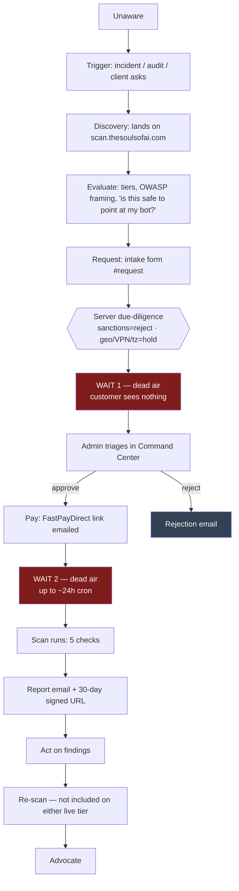

# AI Sec Tester — Customer Journey Map (outside-in)

> **Verified against code, 2026-07-13.** Not against marketing copy.
> **Product:** OWASP **LLM** Top-10 chatbot prompt-injection / jailbreak scanner. Live at `scan.thesoulsofai.com`.
> **Model:** admin-operated. Public site is a **request-a-scan intake form**. There is **no customer login**, **no self-serve checkout**, **no customer-triggered scan**.
> **Customers to date: zero.** No metrics, testimonials or case studies exist. None are invented below.
> `[GAP: ...]` = does not exist in code. `[NEEDS: ...]` = cannot be verified from code.

---

## The one-sentence truth

**From the moment the customer hits Submit, they are in the dark.** There is no account, no status page, no confirmation email, and no way to ask "where is my scan?" except replying to an email they were told to expect — which the code does not send. Every wait state below is a wait on **one human** (Creator/admin), and the customer can see **none of it**.

---

## Journey flow

---

## Stage 1 — Unaware

| | |
|---|---|
| **Do** | Ship a chatbot (widget, support bot, agent) and move on. |
| **See** | Nothing. No search, no category awareness. |
| **Feel** | Nothing. "LLM security" is not a budget line. |
| **Friction / drop-off** | The entire category is unaware-by-default. This is the largest drop-off in the funnel and no product change fixes it. |
| **Today** | Nothing. `[GAP: no top-of-funnel content engine is live — see marketing/automation/00-AUTOMATION-ROADMAP.md]` |

---

## Stage 2 — Trigger

| | |
|---|---|
| **Do** | Something forces the question: a jailbreak screenshot goes around, a client/procurement asks "has your bot been tested?", a compliance form has a box, or they read an OWASP-LLM piece. |
| **See** | Someone else's incident — not ours. |
| **Feel** | Sudden, narrow, time-boxed anxiety. This window closes fast. |
| **Friction** | The trigger is external and we do not control it. If we are not findable **at the moment of the trigger**, the trigger is wasted. |
| **Today** | `llms.txt` + `sitemap.ts` + `robots.ts` (AI crawlers explicitly welcomed) are BUILT. `[GAP: no content/SEO surface that ranks for the trigger query]` |

---

## Stage 3 — Discovery

| | |
|---|---|
| **Do** | Land on `scan.thesoulsofai.com` (`app/page.tsx` → `app/_components/landing.tsx`). |
| **See** | Hero ("Is your AI chatbot *easy to jailbreak?*"), a **mock** A− scorecard, "How it works" (3 steps), "What we check" (6 OWASP-LLM cards), pricing, FAQ, the "Authorization first. Then scan." band, then the request form. |
| **Feel** | Recognition, then immediate suspicion: *who are these people?* |
| **Friction** | **The scorecard in the hero is a mock.** A skeptical buyer who realises it is illustrative loses trust fast. There is no logo wall, no named customer, no sample report to download — **and there cannot be, because there are zero customers.** Honest, but it is a real conversion tax. |
| **Today** | Landing BUILT. `[GAP: no downloadable sample/redacted report — the single highest-value trust asset we could ship without a customer]` |

---

## Stage 4 — Evaluate

| | |
|---|---|
| **Do** | Compare the two tiers. Then ask the real question: *is it safe / legal to point this thing at my production bot?* |
| **See** | Pricing from `lib/payment-links.ts` (single source of truth) with bullet copy from `lib/tier-features.ts`: **Normal $47** — 5 OWASP LLM checks, Pass/Fail scorecard, branded PDF, evidence + remediation per finding; **Advanced $197** — everything in Normal plus all 10 OWASP LLM categories (7 probed live, 3 advisory) across 15 checks. Both tiers get automated risk triage and a human authorization review before anything runs. Plus the "no charge until approved" assurances and the FAQ answer *"Scanning a system you don't own is illegal."* |
| **Feel** | The authorization-first framing is the trust unlock — it reads as a grown-up firm, not a script kiddie tool. Price anchoring works ($47 feels like a no-brainer). |
| **Friction** | **Tier differentiation is not verifiable by the buyer** — and, per the code, it is not real. See the CRITICAL flag below. Also: "Results in seconds" (hero) and "Reviewed within 1 business day" (form) are two contradictory speed promises on the same page. |
| **Today** | Tiers + pricing BUILT and consistent between landing and payment links. **Two sellable tiers only** — Enterprise ($497) was retired 2026-08-02 by ruling R-15 and removed from every buying surface (`SELLABLE_TIERS` in `lib/payment-links.ts` is the gate). Its map entry deliberately survives so the underpayment guard cannot fail open; it is not offered to anyone. Historical blocks below that still name it are the running record, not current pricing. |

> ### CRITICAL — the paid tier does not change the scan
> `executeScan` (`app/actions/scans.ts`) → `runEngineAndPersist` (`lib/scan-persistence.ts`) → **`runScanEngine`** (`lib/scan-engine.ts`, **5 checks, fixed**). `runEngineAndPersist` takes **no tier argument**. The multi-tier engine `runTieredScanEngine` (basic 5 / pro 10 / enterprise 15 checks, `lib/tiered-scan-engine.ts`) is called **only** from `app/api/local-scan/route.ts` — a route the paid pipeline never touches.

> **[CORRECTED 2026-08-01]** The claim below is STALE and no longer true.
> `runEngineAndPersist` (lib/scan-persistence.ts:21) now takes a required
> `tier: ScanTier` argument and forwards it to `runScanEngine`, and
> `testsForTier` (lib/scan-engine.ts:279) returns the core 5 for basic and
> core 5 + 10 extended for advanced/enterprise. Verified against production:
> Enterprise scan `c498084a` persisted 15 result rows, not 5. Kept below as
> the running record of a real defect that was fixed, NOT as current state.

> **Therefore, as of the 2026-07-13 audit:** an Advanced ($197) customer received the **same 5-check scan** as a Normal ($47) customer, and the landing's "Full OWASP LLM Top-10 coverage" claim was **not delivered by the live code path.** (The then-current Enterprise tier, retired 2026-08-02, was in the same bucket.)
> That gap — wire tier → engine, or stop selling the paid tier — was closed on 2026-08-01; see the correction above. It was a refund/chargeback and false-advertising exposure, not a nice-to-have.

---

## Stage 5 — Request

| | |
|---|---|
| **Do** | Fill the intake form at `#request` (`RequestForm` in `app/_components/landing-client.tsx`) → `POST /api/scan-request`. |
| **See** | Plan, name, email, company, country of residence, target URL, context, a live geo readout of *their* country and the *target's* country, the third-party-platform disclosure block, and **two mandatory consent checkboxes** (authorized-to-test + due-diligence). On success: an inline green note — *"Request received. Check your email — we'll review and reply within one business day."* |
| **Feel** | The form is heavier than expected. The consent checkboxes + geo readout convert some ("these people are serious") and scare others off ("why do they need my country?"). |
| **Friction** | Form length is the biggest controllable drop-off. But shortening it would gut the product's spine — the authorization receipt **is** the thing being sold. Keep it. |
| **Today** | BUILT and genuinely server-authoritative: `app/api/scan-request/route.ts` re-checks both consents (400 if missing), resolves requester IP→country and target DNS→country **server-side**, ignores client-claimed geo as advisory, applies honeypot + rate-limit (+ Turnstile **only if** `TURNSTILE_SECRET_KEY` is set — it currently is not, so that check is a no-op). |

---

## Stage 6 — WAIT 1 (triage & due-diligence) — **THE DEAD AIR**

| | |
|---|---|
| **Do** | Wait. Check their inbox. |
| **See** | **NOTHING.** |
| **Feel** | Did it go through? Was I rejected? Is this a real company? |
| **Friction** | **This is the single worst moment in the journey.** |
| **Today** | The server runs sanctions/geo/VPN/timezone-conflict due-diligence and triage automatically, then emails **the operator** (`sendNewRequestAlert` → `resolveOperatorEmail()`). Sanctioned requester **or** sanctioned target → `rejected`. Licence-regulated target (SG/MY) → **held** as `pending_review` with a flag, never auto-rejected. The public response is deliberately uniform — the customer is never told they were auto-declined or held. |

> ### CRITICAL — the confirmation email the form promises does not exist
> The success note says **"Check your email."** `app/api/scan-request/route.ts` sends exactly one email: `sendNewRequestAlert`, addressed to **the operator**, not the requester. **No customer-facing acknowledgement email is sent anywhere in the intake path.**
> **[GAP: send a requester acknowledgement on intake — cheapest, highest-impact fix in this document. Today the site makes a promise the code breaks on every single submission.]**

**Human dependencies in this stage — customer has zero visibility into all of them:**
1. The operator alert email is **best-effort**; a send failure is swallowed (`console.error`) and the request simply waits, silently, forever.
2. Approval is a **manual human action** inside the private Command Center. The old one-click email-approval route (`app/api/enterprise/approve`) now returns **410 Gone** — by design.
3. If the operator is asleep / travelling / not looking at the inbox, nothing moves. There is no SLA mechanism, no escalation, no aging digest. `[GAP: S4 "open requests aging" digest — see 00-AUTOMATION-ROADMAP.md]`

---

## Stage 7 — Pay

| | |
|---|---|
| **Do** | Open the approval email, click the FastPayDirect link, pay $47 or $197. |
| **See** | An approval email carrying a payment link built by `buildPaymentUrl()` (appends `client_reference_id` = the scan-request id, and `prefilled_email`). Then FastPayDirect's own hosted checkout — **a different brand, on a different domain.** |
| **Feel** | Mild brand whiplash at the handoff. Otherwise fine — they already decided. |
| **Friction** | Trust dips at the domain switch. If they hesitate: a **48h reminder** and a **14d auto-close** are coded (`handleStale` in the cron) but both are **GATED** on the T-07 outbound-money-send block. |
| **Today** | `approveScanRequestPayment()` stamps `status=approved_awaiting_payment` + `payment_link_sent_at`. Outbound send is **GATED (T-07)** and delivery additionally requires `RESEND_API_KEY` **and** `CC_EMAIL_SEND_ENABLED === "true"` (`lib/email-templates.ts`). Underpayment guard is BUILT (`markRequestPaid` rejects a $47 settlement against a $197 request). |

---

## Stage 8 — WAIT 2 (the scan) — **THE SECOND DEAD AIR**

| | |
|---|---|
| **Do** | Wait again. They have now **paid** and still have no account, no dashboard, no status. |
| **See** | **NOTHING.** No "payment received", no "scan queued", no progress bar. The landing page promised *"Results in seconds."* |
| **Feel** | Paid-and-silent is the most dangerous state in any business. This is where refund requests are born. |
| **Friction** | Two compounding delays: (a) the pay→`paid_scanning` transition depends on a webhook that is **not confirmed to fire**; (b) even when it does, the dispatcher is a **daily** cron. |
| **Today** | `vercel.json` schedule is **`0 0 * * *` — once a day at 00:00 UTC.** (The route's own doc-comment claiming "every 5 min" is stale and wrong.) Worst-case dispatch latency is **~24h**, not seconds. |

> ### CRITICAL — money → scan is not proven to be automatic
> `app/api/stripe/webhooks/route.ts` reads `client_reference_id` off `checkout.session.completed` and calls `markRequestPaid`. **It is UNCONFIRMED that FastPayDirect forwards `client_reference_id` and fires a signed Stripe webhook at all** (flagged in the route's own comments and in `00-AUTOMATION-ROADMAP.md` G8).
> **If it does not fire, a paid customer sits in `approved_awaiting_payment` until a human notices the money and manually flips them.** The paid step is, today, effectively **manual**.
> **[NEEDS: verify FastPayDirect emits signed webhooks. Until verified, treat "paid → scan starts" as a human step and staff it accordingly.]**

---

## Stage 9 — Receive report

| | |
|---|---|
| **Do** | Open the report email. Click through. |
| **See** | A report email (`composeEmail("report", view)` → `deliverComposedEmail`) with an inline verdict summary and, when Storage is wired, a **30-day signed URL** (`storeReportArtifact`, bucket `reports`). There is also a token-gated report page at `/enterprise/report/[token]`, HMAC-verified (`makeReportToken`), plus a PDF at `/api/scans/[id]/report?token=…`. **No login required** — the token *is* the credential. The `/enterprise` path is the ownership-verification funnel, **not** a price tier, and is not tied to what the customer paid. |
| **Feel** | Relief, then either vindication ("all pass") or alarm ("we leak our system prompt"). |
| **Friction** | RESOLVED 2026-08-01. The stored artifact is now the **rendered PDF** — `storeReportArtifact` calls `buildScanReportPdf` (the same renderer behind `/api/scans/[id]/report`) and uploads `application/pdf`, matching the **"Branded PDF audit report"** the landing promises on every tier. It previously uploaded the composed email body as text. |
| **Today** | Report email BUILT. Signed URL BUILT (fail-soft → null if bucket missing). HMAC token page BUILT. PDF artifact BUILT (A6 closed 2026-08-01). `[NEEDS: verify the `reports` bucket is private / signed-URL-only]` |

---

## Stage 10 — Act on findings

| | |
|---|---|
| **Do** | Hand the report to a developer. Fix the flagged prompt/guardrail issues. |
| **See** | Per-finding evidence + remediation guidance (`lib/remediation-guidance.ts`). |
| **Feel** | Either "this is actionable" or "I don't know what to do with this." |
| **Friction** | Findings whose status is `not_run` (interactive probes that cannot be truthfully executed against an arbitrary embedded widget) are **persisted to the DB as `pending`** — the schema CHECK allows only `pending\|running\|pass\|fail`. A customer reading a scorecard row as "pending" will reasonably think **the scan is still running.** That is a bad word for "we could not test this." |
| **Today** | Guidance BUILT. `[GAP: no follow-up/nurture after report delivery. The report email is the last contact the customer ever receives.]` |

---

## Stage 11 — Re-scan

| | |
|---|---|
| **Do** | After fixing, come back for a second look — and find that **neither live tier includes one.** |
| **See** | The route exists at `/enterprise/rescan?token=<re_scan_token>` (the ownership-verification path, not a tier), but nothing in the Normal or Advanced bullets promises a free re-scan, and no email ever hands them a token. |
| **Feel** | Nothing, because nothing invites them back. A fixed bot is a customer with no reason to return. |
| **Friction** | **There is no re-scan offer to lapse and no reminder to send.** The 30-day signed report URL simply expires. The one tier that used to advertise "1 free re-scan after fixes" was Enterprise, retired 2026-08-02 (R-15) — and that promise was never delivered while it was on sale either (`app/actions/scans.ts:90` says the rescan path is not live). |
| **Today** | Re-scan route BUILT but unwired to any purchase. `[GAP: the 30-day re-scan invite (G7 / S5) is NOT BUILT.]` `[CREATOR-GATE: decide whether a re-scan becomes an Advanced benefit or a paid add-on before any copy promises it again.]` |
| **Caution** | `executeScan`'s scan-row reuse "assumes no prior results" — a re-run needs `scan_results` cleared first. The bounded-retry path in `run-scan.ts` does this; **the customer-initiated rescan path must be verified to do the same** or a re-scan could merge into stale results. `[NEEDS: verify /enterprise/rescan clears prior scan_results]` |

---

## Stage 12 — Advocate

| | |
|---|---|
| **Do** | Tell someone. Or not. |
| **See** | No ask. No feedback request. No referral mechanism. |
| **Feel** | Indifference, most likely — the last thing that happened to them was a silent wait followed by a PDF. |
| **Friction** | The testimonial ask (G6) is coded-but-gated on outbound send. **Publishing a testimonial requires explicit customer consent — and none may ever be fabricated.** |
| **Today** | `[GAP: no post-delivery ask of any kind.]` |

---

## Every point where the customer waits on a human, with zero status visibility

| # | Moment | Who they're waiting on | What they see | Fix |
|---|---|---|---|---|
| 1 | Immediately after Submit | — (a promise the code doesn't keep) | An on-page note telling them to check an email **that is never sent** | **Send a requester ack email.** Highest impact, lowest cost. |
| 2 | Triage → approve | The operator, manually, in the Command Center | Nothing | Ack email should set expectations ("within 1 business day"). Operator needs the S4 aging digest so nothing rots. |
| 3 | Operator alert silently fails | Nobody — the request rots forever | Nothing | S4 daily digest is the only backstop. |
| 4 | After paying | A webhook that may not exist | Nothing | Verify FPD webhook (G8); until then, staff a manual "mark paid" check. |
| 5 | Waiting for the scan | A **daily** cron | Nothing | Send a "payment received — report within 24h" email at `paid_scanning`, and stop saying "in seconds". |
| 6 | After the report lands | Nobody — the 30-day URL just expires | Nothing | Decide whether a re-scan is an Advanced benefit or a paid add-on, then build G7 (30-day invite). |

**There is no customer-facing status surface anywhere in this product.** By architecture (`project-ai-sec-tester-architecture`: public site = request-a-scan landing, **NO customer login**) that is intentional. The consequence is that **email is the only channel** — which makes the missing acknowledgement email (#1) not a polish item but a structural hole in the funnel.

---

## Honest summary of what a real customer would experience today

1. Submits the form. Gets an on-page "check your email" — **no email arrives.**
2. Waits an unknown time for a human who has no aging alert.
3. If approved, gets a pay link (gated — T-07 must be lifted by Creator first).
4. Pays. **Possibly nothing happens**, because the webhook is unverified.
5. ~~If it does fire, waits up to **24h** for a daily cron.~~ FIXED 2026-08-01 — the cron can only run daily on this plan, so the dispatcher self-chains while work remains; the queue drains back-to-back at ~1 scan per 100–170s instead of waiting for midnight. `[UNVERIFIED: never exercised under real burst load]`
6. ~~Receives a **5-check** scan — regardless of whether they paid $47 or $197.~~ FIXED 2026-08-01 — the tier resolves to its real check-set and the report states the commitment honestly ("4 of 15 checks passed, 11 NOT RUN") instead of dividing by what happened to run. Checks that do not run are still capped by the `/api/chat` rate limit — see the open blocker in §Risks.
7. ~~Gets a **plain-text** artifact where a "branded PDF" was promised.~~ FIXED 2026-08-01 — the uploaded artifact is the rendered PDF.
8. Never hears from us again.

Fix order (cheapest → most valuable): ~~requester ack email → tier→engine wiring → PDF-in-storage~~ (all three closed 2026-08-01) → **FPD webhook verification → paid/queued status emails → re-scan invite.**
